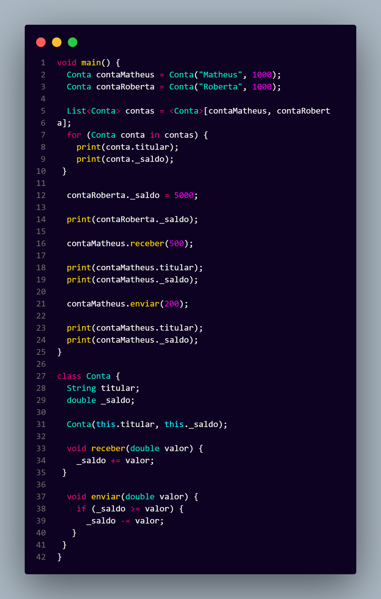
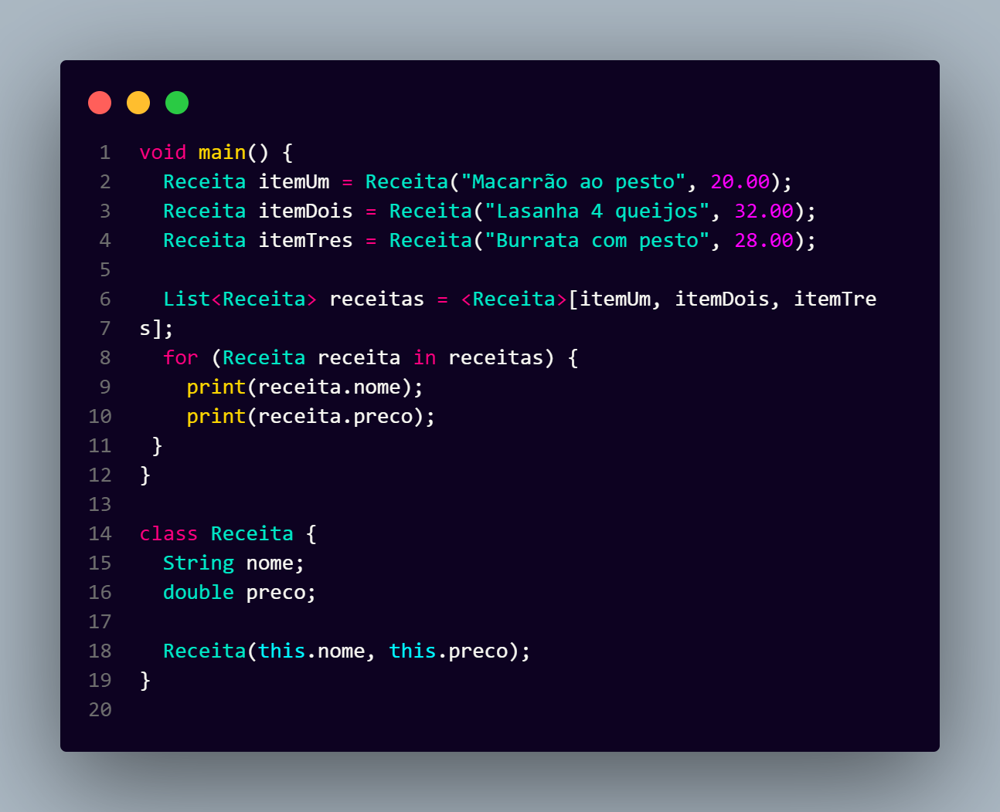
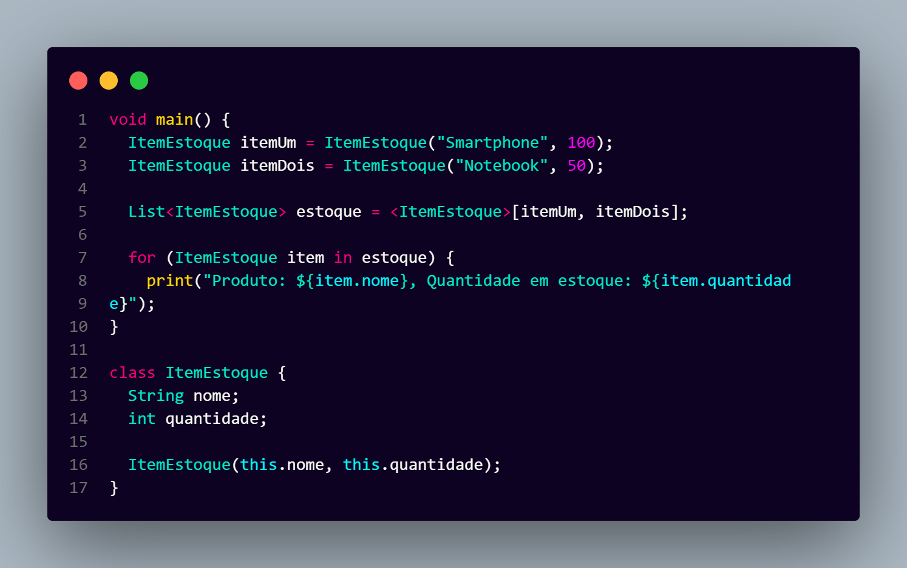

# Contas em Dart

Este projeto é um exemplo de um programa em **Dart** que simula contas bancárias.  
Ele permite criar contas, enviar e receber dinheiro, e mostrar o saldo de cada conta.

---

## 📌 Funcionalidades

- Criar contas com titular e saldo inicial.
- Receber dinheiro (adicionar saldo).
- Enviar dinheiro (subtrair saldo, com verificação de saldo disponível).
- Exibir titular e saldo da conta.

---

## 🖥️ Exemplo de Saída

Abaixo está um exemplo do programa sendo executado (print do console):

---

## 🍝 Receitas

Este exercício cria uma lista de receitas com nome e preço, simulando um pequeno cardápio.  
Permite exibir cada receita e seu valor, funcionando como um exemplo de manipulação de listas em Dart.

---

## 📦 Estoque

Neste exercício, é criada uma lista de itens em estoque com nome e quantidade.  
O programa exibe cada produto e sua quantidade disponível, servindo como prática de listas e objetos em Dart.

